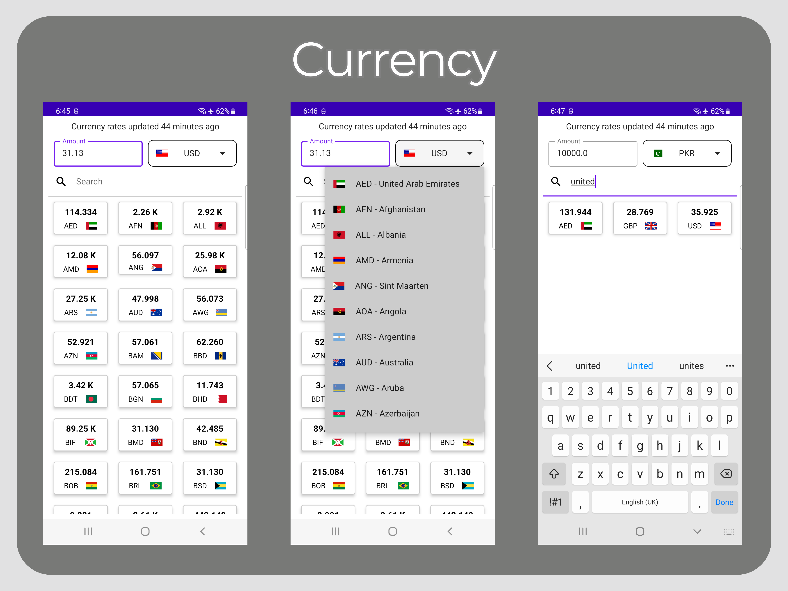

# Currency

A sample project created for implementing Google's MVVM recommended architecture.

## Description
This app shows the list of currencies in a grid, with the ability to select a base currency from a dropdown. This app is written following the 
recommended architecture guide by Google which is MVVM with Repository pattern, as this gives the opportunity 
to write clean and concise code with clear separation of concerns. 

## Currency
This app uses Open Exchange (https://openexchangerates.org) api to fetch the currency rates in real time. Also it uses Country Flags (https://flagsapi.com/) api for showing the flag of the currency's country.
To run this app, you will need to add your Open Exchange app id in local.properties  

## Tech stack & Open-source libraries
- Architecture
    - MVVM Architecture
    - Repository Pattern
- Kotlin based, Coroutines + Flow for asynchronous.
- Hilt for dependency injection.
- Room for database
- Jetpack
    - Compose
    - Lifecycle
    - ViewModel
- Retrofit 2 and OkHttp for networking
- Gson for JSON mapping to objects

